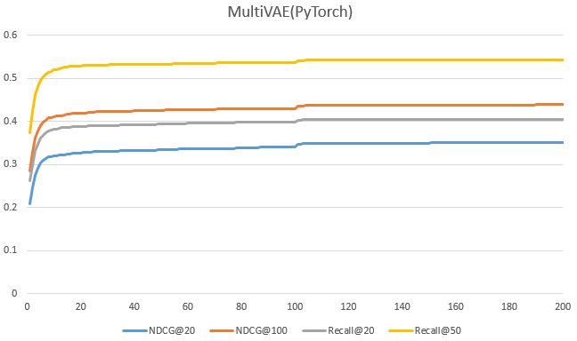

## Variational autoencoders for collaborative filtering in PyTorch.

This repo implements Variational autoencoders for collaborative filtering in PyTorch presented in [1],
and also does conditional VAE [2] to use user profiles in collaborative filtering.
Numerical expriments are done for MovieLens dataset for VAE and Last.fm for conditional VAE. 

### Dataset

Download datasets from:
* [MovieLens 20M Dataset](https://grouplens.org/datasets/movielens/20m/)
* [Last.fm Dataset - 360K users](http://ocelma.net/MusicRecommendationDataset/lastfm-360K.html)

### Training

Usage: 
```bash
python demo.py train <options>
```

### Results

|model|data|NDCG@50(validation)|NDCG@50(test)|
| :--- | :--- | :---: | :---: |
|DAE(TensorFlow)|MovieLens 20M|0.42778|0.42113|
|DAE(PyTorch)|MovieLens 20M|0.42574|0.41932|
|VAE(TensorFlow)|MovieLens 20M|0.43340|0.42593|
|VAE(PyTorch)|MovieLens 20M|0.43887|0.43093|
|VAE(PyTorch)|Last.fm 360K|0.39175|0.39152|
|VAE(PyTorch) conditioned on gender, age and country|Last.fm 360K|0.38344|0.38346|

#### NDCG@N and Recall@N of VAE(PyTorch) for MovieLens 20M



## References

1. Dawen Liang, Rahul G. Krishnan, Matthew D. Hoffman, Tony Jebara. Variational Autoencoders for Collaborative Filtering,
    The Web Conference (WWW), 2018.  
    [arXiv](https://arxiv.org/abs/1802.05814), [github](https://github.com/dawenl/vae_cf)
    
2. Kihyuk Sohn, Honglak Lee, and Xinchen Yan. Learning Structured Output
    Representation Using Deep Conditional Generative Models. Advances in
    Neural Information Processing Systems, 2015. 
    [NIPS](https://papers.nips.cc/paper/5775-learning-structured-output-representation-using-deep-conditional-generative-models)
    
3. Irina Higgins, Loic Matthey, Arka Pal, Christopher Burgess, Xavier Glorot, Matthew Botvinick, Shakir Mohamed, Alexander Lerchner. 
    beta-VAE: Learning basic visual concepts with a constrained variational framework. ICLR, 2017.
    [Paper link](https://openreview.net/forum?id=Sy2fzU9gl)
